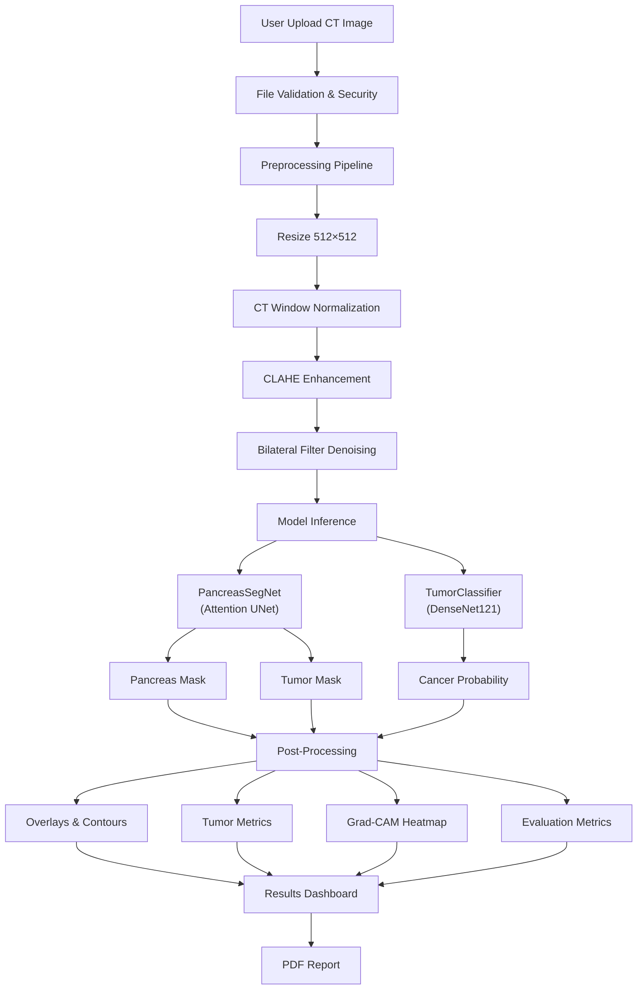

# 🧬 PancreasAI — AI-Powered Pancreatic Cancer Detection & Segmentation

<p align="center">
  <strong>Advanced Deep Learning System for Automated Pancreas Segmentation, Tumor Detection, and Clinical Analysis</strong>
</p>

<p align="center">
  
  
  
  
</p>

---

## 📋 Table of Contents

- [🧬 PancreasAI — AI-Powered Pancreatic Cancer Detection \& Segmentation](#-pancreasai--ai-powered-pancreatic-cancer-detection--segmentation)
  - [📋 Table of Contents](#-table-of-contents)
  - [🔬 Overview](#-overview)
  - [✨ Features](#-features)
  - [🏗️ Architecture](#️-architecture)
    - [Model Architectures](#model-architectures)
  - [💻 Installation](#-installation)
    - [Prerequisites](#prerequisites)
    - [Steps](#steps)
  - [🚀 Quick Start](#-quick-start)
  - [📁 Folder Structure](#-folder-structure)
  - [📊 Dataset Preparation](#-dataset-preparation)
    - [Recommended Datasets](#recommended-datasets)
    - [Data Format](#data-format)
    - [Preprocessing for Training](#preprocessing-for-training)
  - [🧠 Model Checkpoints](#-model-checkpoints)
    - [Using Your Own Trained Models](#using-your-own-trained-models)
    - [Architecture Customization](#architecture-customization)
  - [📖 Training Instructions](#-training-instructions)
    - [Segmentation Model](#segmentation-model)
    - [Classification Model](#classification-model)
  - [🖥️ Inference Guide](#️-inference-guide)
    - [Web Interface](#web-interface)
    - [Python API](#python-api)
    - [cURL](#curl)
  - [📡 API Documentation](#-api-documentation)
    - [`POST /api/predict`](#post-apipredict)
    - [`GET /api/metrics/<file_id>`](#get-apimetricsfile_id)
  - [🔮 Future Improvements](#-future-improvements)
  - [📚 References](#-references)
    - [Research Papers \& Repositories](#research-papers--repositories)
    - [Technologies](#technologies)
  - [📄 License](#-license)

---

## 🔬 Overview

PancreasAI is a **production-quality web application** for pancreatic cancer detection and segmentation. It combines state-of-the-art deep learning models with a professional medical dashboard interface.

The system accepts CT scan images (PNG/JPG/JPEG) and performs:

- **Pancreas segmentation** using an Attention UNet (PaNSegNet-inspired)
- **Tumor detection & localization** with anatomical region classification
- **Cancer classification** using DenseNet121 with transfer learning
- **Explainability visualization** via Grad-CAM heatmaps
- **Comprehensive evaluation metrics** following PaNSegNet and PanTS benchmark protocols
- **Hospital-style PDF reports** with clinical summaries

> ⚠️ **Medical Disclaimer**: This is a research/educational tool, NOT a certified medical device. All AI predictions must be validated by qualified healthcare professionals.

---

## ✨ Features

| Feature                       | Description                                               |
| ----------------------------- | --------------------------------------------------------- |
| 🔍 **Pancreas Segmentation**  | Attention UNet with 4-level encoder-decoder architecture  |
| 🎯 **Tumor Detection**        | Automated localization — Head, Body, or Tail              |
| 📊 **Cancer Classification**  | DenseNet121 binary classifier with confidence scores      |
| 🔥 **Grad-CAM Heatmaps**      | Visual explainability for model decisions                 |
| 📏 **14+ Evaluation Metrics** | Dice, IoU, HD95, Precision, Recall, F1, ASD, VS, and more |
| 📄 **PDF Reports**            | Hospital-style downloadable clinical reports              |
| 🌙 **Dark Mode**              | Toggle between light and dark themes                      |
| 📱 **Responsive Design**      | Works on desktop, tablet, and mobile                      |
| 🖱️ **Drag & Drop Upload**     | Intuitive file upload with preview                        |
| 🚀 **Demo Mode**              | Works without trained models using simulated results      |
| ⚡ **GPU Acceleration**       | CUDA support with mixed precision inference               |
| 🔒 **Security**               | File validation, size limits, sanitized filenames         |

---

## 🏗️ Architecture



### Model Architectures

**PancreasSegNet (Segmentation)**

- UNet-style encoder-decoder with Attention Gates
- 4 encoder levels: [64, 128, 256, 512] features
- Bottleneck: 1024 features
- Skip connections with attention gating
- Input: [1, 1, 512, 512] → Output: [1, 3, 512, 512]
- 3-class: Background, Pancreas, Tumor

**TumorClassifier (Classification)**

- DenseNet121 backbone with transfer learning
- Custom classifier head: Dropout → Linear(256) → ReLU → Linear(2)
- Input: [1, 3, 224, 224] → Output: [1, 2]
- 2-class: Normal, Cancer

---

## 💻 Installation

### Prerequisites

- Python 3.11+
- pip or conda
- (Optional) NVIDIA GPU with CUDA

### Steps

```bash
# 1. Clone the repository
git clone <your-repo-url>
cd Pancreas

# 2. Create virtual environment
python -m venv venv

# Windows
venv\Scripts\activate

# macOS/Linux
source venv/bin/activate

# 3. Install dependencies
pip install -r requirements.txt

# 4. Run the application
python app.py
```

The server starts at `http://localhost:5000`

---

## 🚀 Quick Start

1. **Start the server**: `python app.py`
2. **Open browser**: Navigate to `http://localhost:5000`
3. **Upload image**: Drag & drop a CT scan image (PNG/JPG/JPEG)
4. **View results**: Explore the analysis dashboard with segmentation, heatmaps, and metrics
5. **Download report**: Click "Download Full Report (PDF)"

> 💡 The application runs in **Demo Mode** by default (without trained model checkpoints). It generates realistic simulated results for UI testing.

---

## 📁 Folder Structure

```
Pancreas/
│
├── app.py                     # Flask application entry point
├── config.py                  # Central configuration
├── requirements.txt           # Python dependencies
├── Procfile                   # Gunicorn deployment config
├── README.md                  # This file
│
├── models/                    # Model checkpoint directory
│   ├── pansegnet_model.pth    # Segmentation weights (user-provided)
│   └── tumor_classifier.pth   # Classifier weights (user-provided)
│
├── utils/                     # ML pipeline modules
│   ├── __init__.py
│   ├── preprocessing.py       # Image preprocessing (resize, normalize, CLAHE)
│   ├── inference.py           # Model architectures & inference engine
│   ├── segmentation.py        # Mask post-processing, overlays, tumor metrics
│   ├── metrics.py             # Evaluation metrics (Dice, IoU, HD95, etc.)
│   ├── gradcam.py             # Grad-CAM & explainability visualizations
│   └── report.py              # PDF report generation
│
├── templates/                 # Jinja2 HTML templates
│   ├── base.html              # Base layout (nav, footer, loading overlay)
│   ├── index.html             # Landing page with upload form
│   └── result.html            # Results dashboard
│
└── static/                    # Static assets
    ├── css/
    │   ├── style.css          # Main design system
    │   └── dashboard.css      # Results dashboard styles
    ├── js/
    │   ├── main.js            # Dark mode, navigation, animations
    │   ├── upload.js          # Drag & drop file upload
    │   └── charts.js          # Chart.js visualizations
    ├── uploads/               # Uploaded CT scan images
    ├── outputs/               # Preprocessed images & overlays
    ├── heatmaps/              # Grad-CAM heatmaps
    ├── masks/                 # Segmentation masks
    └── reports/               # Generated PDF reports
```

---

## 📊 Dataset Preparation

### Recommended Datasets

| Dataset          | Source                                                                  | Size           | Description                                       |
| ---------------- | ----------------------------------------------------------------------- | -------------- | ------------------------------------------------- |
| **PanTS**        | [GitHub](https://github.com/MrGiovanni/PanTS)                           | 36,390 volumes | Multi-institutional pancreatic tumor segmentation |
| **NIH Pancreas** | [NIH](https://wiki.cancerimagingarchive.net/display/Public/Pancreas-CT) | 82 scans       | CT scans with pancreas segmentation               |
| **MSD Pancreas** | [MSD](http://medicaldecathlon.com/)                                     | 420 scans      | Medical Segmentation Decathlon Task 07            |

### Data Format

- **Training**: NIfTI format (`.nii.gz`) converted to 2D slices (PNG)
- **Inference**: PNG, JPG, JPEG (single 2D slices)
- **Future**: DICOM, NIfTI direct support planned

### Preprocessing for Training

```python
# Extract 2D slices from NIfTI volumes
import nibabel as nib
import cv2
import numpy as np

volume = nib.load("ct_scan.nii.gz").get_fdata()
for i in range(volume.shape[2]):
    slice_2d = volume[:, :, i]
    slice_normalized = ((slice_2d - slice_2d.min()) / (slice_2d.max() - slice_2d.min()) * 255).astype(np.uint8)
    cv2.imwrite(f"slices/slice_{i:04d}.png", slice_normalized)
```

---

## 🧠 Model Checkpoints

### Using Your Own Trained Models

1. Train your segmentation model (must match `PancreasSegNet` architecture in `utils/inference.py`)
2. Train your classifier model (must match `TumorClassifier` architecture)
3. Save checkpoints:
   ```python
   torch.save(seg_model.state_dict(), "models/pansegnet_model.pth")
   torch.save(cls_model.state_dict(), "models/tumor_classifier.pth")
   ```
4. The application automatically detects checkpoint files and switches from demo mode to real inference.

### Pretrained Model Links

If you want to use pretrained segmentation backbones, you can download models from Hugging Face:

- [MedFormerPanTS Pancreas release](https://huggingface.co/AbdomenAtlas/MedFormerPanTS/tree/main/pants_pancreas_release)
- [R-SuperPanTS Merlin pancreas release](https://huggingface.co/AbdomenAtlas/R-SuperPanTSMerlin/tree/main/merlin_pancreas_pants_release)

### Architecture Customization

Edit `config.py` to change model parameters:

```python
SEG_INPUT_CHANNELS = 1       # Input channels (1 for grayscale CT)
SEG_OUTPUT_CHANNELS = 3      # Output classes (background, pancreas, tumor)
SEG_FEATURES = [64, 128, 256, 512]  # Encoder feature sizes
NUM_CLASSES = 2              # Classification: Normal vs Cancer
```

---

## 📖 Training Instructions

### Segmentation Model

```python
import torch
from utils.inference import PancreasSegNet

model = PancreasSegNet(in_channels=1, out_channels=3)
optimizer = torch.optim.Adam(model.parameters(), lr=1e-4)
criterion = torch.nn.CrossEntropyLoss()

# Training loop
for epoch in range(100):
    for images, masks in train_loader:
        outputs = model(images)
        loss = criterion(outputs, masks)
        optimizer.zero_grad()
        loss.backward()
        optimizer.step()

torch.save(model.state_dict(), "models/pansegnet_model.pth")
```

### Classification Model

```python
from utils.inference import TumorClassifier

model = TumorClassifier(num_classes=2, pretrained=True)
optimizer = torch.optim.Adam(model.parameters(), lr=1e-4)
criterion = torch.nn.CrossEntropyLoss()

# Training loop with transfer learning
for epoch in range(50):
    for images, labels in train_loader:
        outputs = model(images)
        loss = criterion(outputs, labels)
        optimizer.zero_grad()
        loss.backward()
        optimizer.step()

torch.save(model.state_dict(), "models/tumor_classifier.pth")
```

---

## 🖥️ Inference Guide

### Web Interface

1. Start server: `python app.py`
2. Open `http://localhost:5000`
3. Upload → View Results → Download Report

### Python API

```python
import requests

with open("ct_scan.png", "rb") as f:
    response = requests.post(
        "http://localhost:5000/api/predict",
        files={"file": f}
    )

result = response.json()
print(f"Prediction: {result['prediction']}")
print(f"Confidence: {result['confidence']}%")
print(f"Tumor Area: {result['tumor_area']} cm²")
```

### cURL

```bash
curl -X POST -F "file=@ct_scan.png" http://localhost:5000/api/predict
```

---

## 📡 API Documentation

### `POST /api/predict`

Upload an image for analysis.

**Request**: `multipart/form-data` with `file` field

**Response**:

```json
{
  "prediction": "Pancreatic Cancer",
  "confidence": 98.1,
  "cancer_probability": 96.43,
  "tumor_area": 4.8,
  "tumor_volume": 23.4,
  "tumor_location": "Pancreatic Head",
  "risk_level": "Very High",
  "stage_suggestion": "Possible Stage I-II (T1-T2)",
  "dice_score": 0.91,
  "iou": 0.87,
  "precision": 0.94,
  "recall": 0.92,
  "f1_score": 0.93,
  "inference_time": 2.34,
  "file_id": "abc123...",
  "demo_mode": true
}
```

### `GET /api/metrics/<file_id>`

Retrieve evaluation metrics for a completed analysis.

---

## 🔮 Future Improvements

The architecture is designed to support:

- [ ] **DICOM support** — Direct `.dcm` file upload
- [ ] **NIfTI support** — `.nii` / `.nii.gz` 3D volumes
- [ ] **3D CT volume inference** — Full volume analysis
- [ ] **MRI support** — Multi-modality imaging
- [ ] **Multi-class tumor segmentation** — PDAC, IPMN, NET, etc.
- [ ] **Doctor login & patient database** — Authentication system
- [ ] **Cloud deployment** — AWS, GCP, Azure
- [ ] **Docker & Kubernetes** — Containerized deployment
- [ ] **REST API expansion** — Full CRUD operations
- [ ] **Hugging Face hosting** — Model sharing
- [ ] **ONNX export** — Cross-framework inference
- [ ] **TensorRT inference** — NVIDIA optimization
- [ ] **Explainable AI dashboard** — Interactive attention exploration
- [ ] **ROC curve & confusion matrix** — Extended analytics
- [ ] **Batch processing** — Multiple image analysis

---

## 📚 References

### Research Papers & Repositories

1. **PaNSegNet** — Large-Scale Multi-Center CT and MRI Segmentation of Pancreas with Deep Learning
   - Repository: [github.com/NUBagciLab/PaNSegNet](https://github.com/NUBagciLab/PaNSegNet)

2. **PanTS** — The Pancreatic Tumor Segmentation Dataset (NeurIPS 2025)
   - Repository: [github.com/MrGiovanni/PanTS](https://github.com/MrGiovanni/PanTS)
   - 36,390 3D CT volumes from 145 centers

3. **nnU-Net** — Self-configuring framework for medical image segmentation
   - Isensee et al., Nature Methods 2021

4. **Grad-CAM** — Visual Explanations from Deep Networks
   - Selvaraju et al., ICCV 2017

### Technologies

- [Flask](https://flask.palletsprojects.com/) — Web framework
- [PyTorch](https://pytorch.org/) — Deep learning framework
- [MONAI](https://monai.io/) — Medical imaging AI toolkit
- [Chart.js](https://www.chartjs.org/) — JavaScript charting
- [ReportLab](https://www.reportlab.com/) — PDF generation

---

## 📄 License

This project is for research and educational purposes.
Please refer to the licenses of referenced repositories (PaNSegNet, PanTS) for their respective terms.

---

<p align="center">
  Built with ❤️ by HEMANTH S.P
</p>
